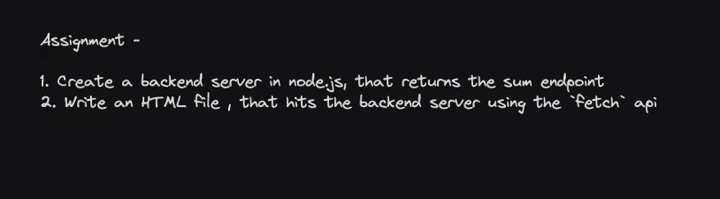

# **Week 05 - 5.2 | Middlewares and Cors**

## Assignment #1 - Try converting the calculator assignment to use POST endpoints. Check if it works with/without the express.json middleware

## Assignment #2 - Create a middleware function that logs each incoming request’s HTTP method, URL, and timestamp to the console

## Assignment #3 - Create a middleware that counts total number of requests sent to a server. Also create an endpoint that exposes it

## Assignment #4 - Create a backend server in node.js, that returns the sum endpoint

## Assignment #5 - Write an HTML file, that hits the backend server using `fetch` API

or,

