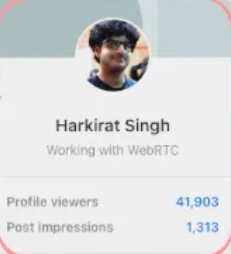
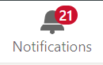

# **Week 09 - Offline Videos**

## Assignment #1 - Create linkedin ProfileCard Component Just after the Post Component

-   Reference [Post Component Code](./1.%20React%20Part%201%20-%20useState,%20useEffect,%20props,%20components,%20conditional%20rendering/02_components/)

## Assignment #2 - Create a LinkedIn notification component that increases by 1 every 5 seconds.

